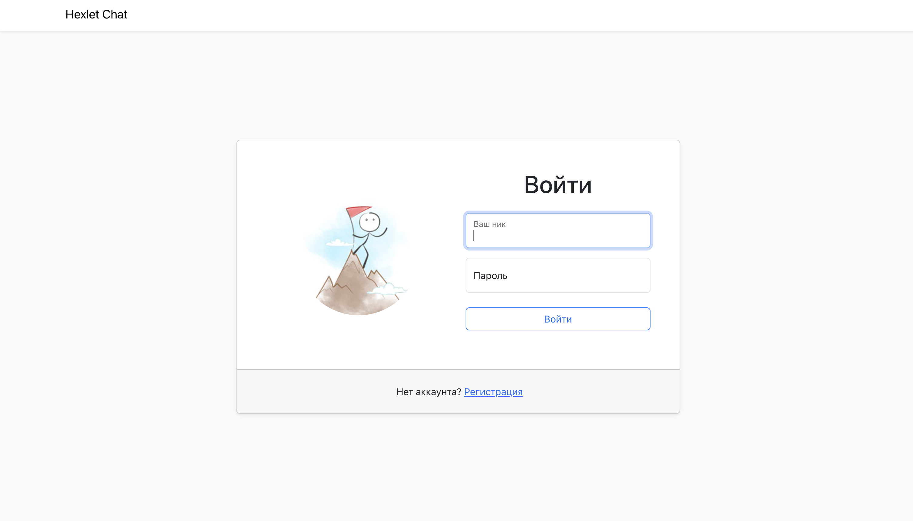
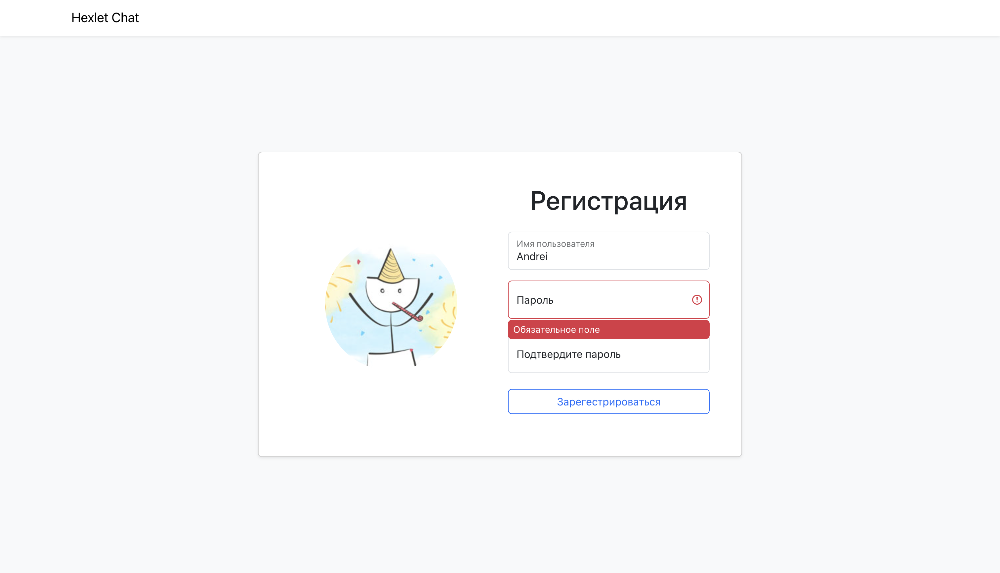
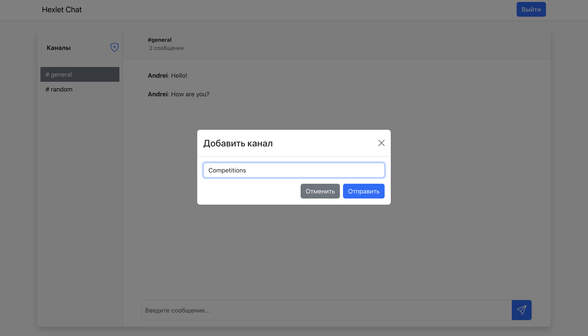
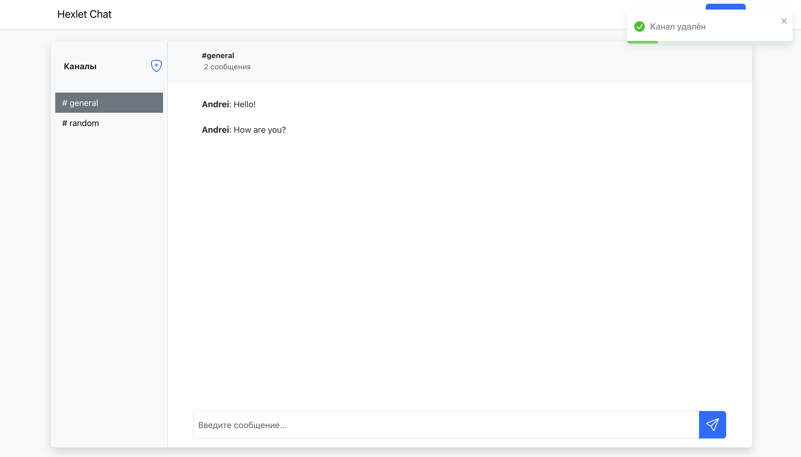

# Chat (slack)
This project is the development of a simplified analogue of Slack chat using modern interface development technologies. The work implements authorization, routing, form management, styling, error handling, and deployment.

## Demo
You can check out the live version of the project at the following [link](https://slack-chat-rxfy.onrender.com).

## Hexlet tests, linter status and maintainability:
  
  

## Technologies Used
- **React** — Hooks, context, optimization
- **Redux Toolkit** — Global state management
- **React Router** — Client-side routing
- **WebSockets** — Real-time communication
- **REST API** — Server interaction
- **Formik** — Form management
- **Yup** — Form validation
- **react-toastify** — Notifications
- **leo-profanity** — Profanity filtering
- **i18next** — Internationalization
- **axios** — HTTP client
- **react-bootstrap** — UI components
- **Bootstrap** — Styling framework
- **Vite** — Project bundling
- **Rollbar** — Error monitoring
- **Deployment** — Application deployed on Render

## Screenshots

### Authorization

### Validation

### Modals

### Main page

## Local Setup
To run the project locally, follow these steps:

1. Clone the repository:

   <pre><code>git clone https://github.com/Disielsida/frontend-project-12.git</code></pre>

2. Install dependencies:

   <pre><code>make install</code></pre>

3. Start the development server:

   <pre><code>make develop</code></pre>